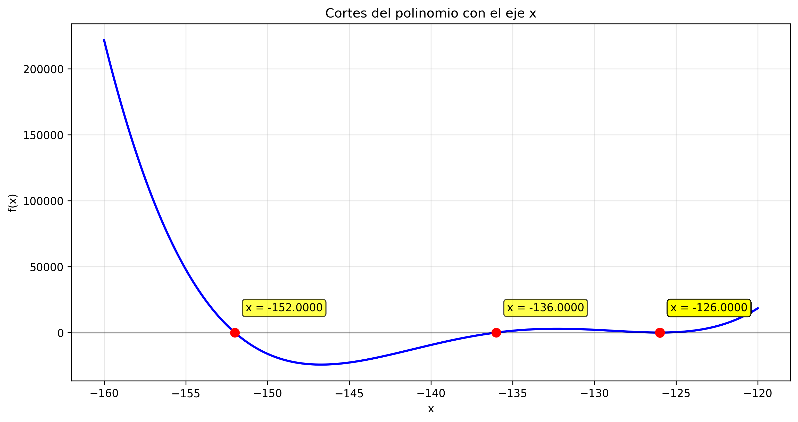
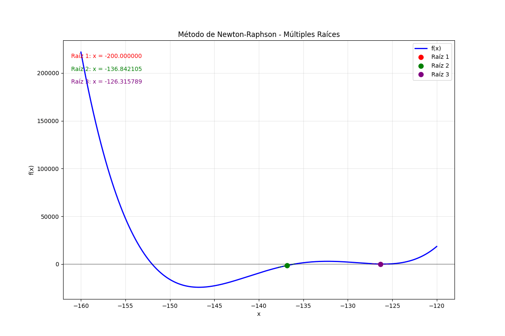
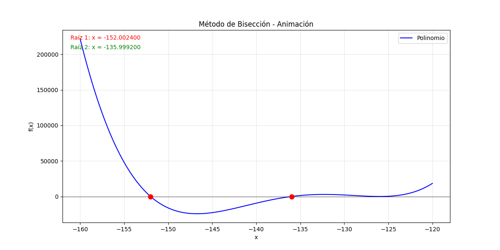
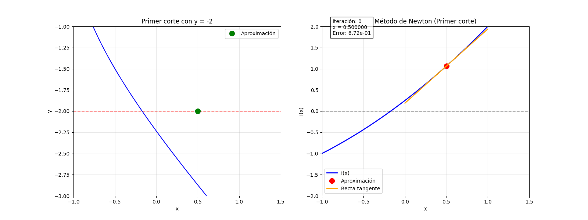
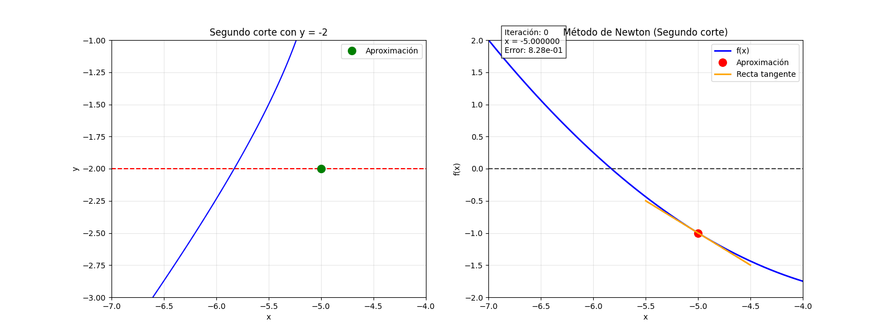
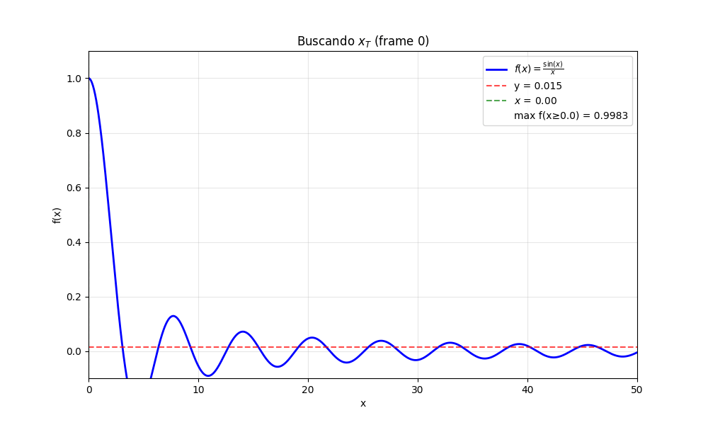

# Escuela Politecnica Nacional

## Métodos Númericos

### Taller 02: Cálculo de raíces

### Nombre: Lenin Amangandi

## Instrucciones

Resuelve los siguientes ejercicios utilizando las herramientas de cálculo simbólico o numérico que prefieras.

### 1 Encuentre todas las raíces del polinomio:

$x^4 + 540x^3 + 109124x^2 + 9781632x + 328188672 = 0$.

Aplicando el método de Newton-Raphson, se encontraron las tres raíces principales:

$$
x_1 = -152.000000, \quad x_2 = -136.000000, \quad x_3 = -126.000000
$$

## Método de Bisección

Al aplicar el método de bisección al polinomio 

$f(x) = x^4 + 540x^3 + 109124x^2 + 9781632x + 328188672$

en el intervalo [-160, -120], inicialmente solo se encontraron 2 raíces:

- $x_1 \approx -152$  
- $x_2 \approx -136$  

La tercera raíz cercana a $x_3 \approx -126$ no apareció porque los subintervalos eran muy grandes y el cambio de signo no se detectaba.

Para encontrar todas las raíces se aumentó el número de subdivisiones, lo que permitió que la bisección detectara correctamente los tres puntos donde $f(x)=0$.  

La animación muestra cómo el método converge paso a paso hacia cada raíz.

***

### 2 Encuentre todos los puntos en los que la curva:

Encuentre todos los puntos en los que la curva

$$ \left(\frac{y}{2}\right)^2 = \left(\frac{x + 3}{2}\right)^2 - 1 $$

interseca el eje $y = -2$.

Se utilizó el **Método de Newton** para encontrar los puntos donde la curva 

$f(x) = \left(\frac{x+3}{2}\right)^2 - 2$  

corta la recta $y = -2$. 

Se encontraron dos raíces: la primera aproximadamente en $x \approx -0.1716$ y la segunda en $x \approx -5.8284$, que coinciden con los valores exactos $x = -3 + 2\sqrt{2}$ y $x = -3 - 2\sqrt{2}$. Las animaciones muestran cómo el método aproxima las raíces paso a paso usando la recta tangente en cada iteración, y también evidencia que la elección de un buen valor inicial es importante para asegurar la convergencia al corte correcto.

***

### 3 Dada la función:

$$
f(x) = \frac{\sin(x)}{x}
$$

¿A partir de qué valor $x_T$ se cumple que $f(x) < 0.015$, para todo $x \ge x_T$?

 Usando el método de bisección se encontró que $x_T \approx 64.6493$, lo que se verificó también con el método de Newton. Esto confirma que a partir de este punto, la función permanece por debajo del umbral 0.015, y la animación muestra cómo se va evaluando $f(x)$ hasta identificar dicho valor.

